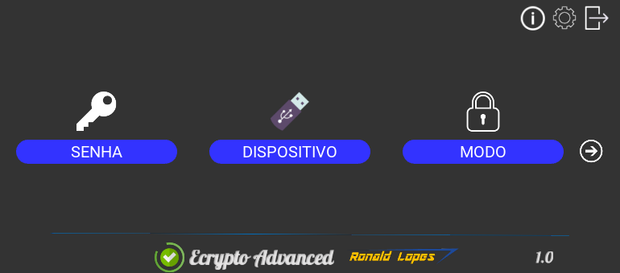
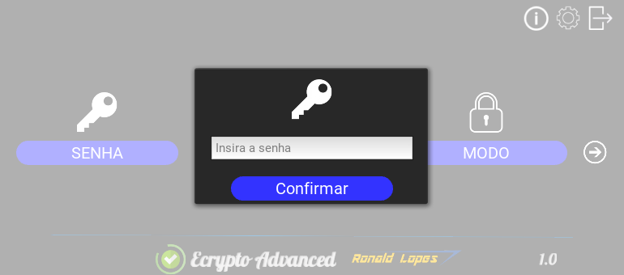
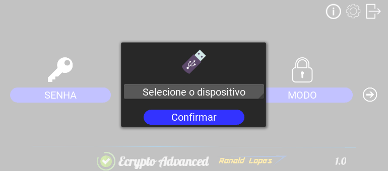
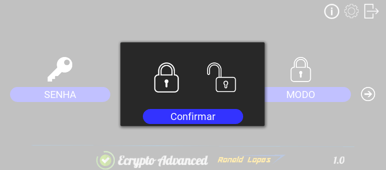

# Ferramenta de Criptografia com compressão de dados para dispositivos removíveis
Programa desenvolvido em Python 3.6 com framework Kivy, utiliza a criptografia AES e o algoritmo de compressão Zstandard (ZSTD) desenvolvido pela equipe do Facebook.



## Instalando as dependências necessárias 
Para instalar as dependências necessárias primeiro certifique de possuir instalado a versão 3.5 do python. Em seguida vamos precisar instalar a versão de desenvolvimento do python:
```
sudo apt-get install python3.6-dev
```
Instalado corretamente o pacote acima, vamos atualizar o gerenciador de pacotes do python (pip):
```
pip install --upgrade pip
```
Pronto, agora já podemos instalar as dependências que estão contidas no aquivo *requirements.txt*, vamos executar o seguinte comando dentro do diretorio onde contem os arquivos do projeto:
```
pip install -r requirements.txt
```
## Iniciando a aplicação
Para inicializar a aplicação utilize o comando:
```
python3 main.py
```
Uma tela semelhante a essa deve surgir:


Para iniciar a criptografia informe a senha a ser utilizada clicando na opção "SENHA":



Em seguida, selecione um dispositivo clicando na opção "DISPOSITIVO", uma tela para selecionar o dispositivo removível deverá surgir:



Após confirmado o dispositivo, selecione o modo desejado, se você deseja criptografar ou descriptografar os arquivos:



Clique no botão com o ícone de seta para iniciar a operação, um aviso deverá ser exibido quando a operação terminar. 

> OBS: Lembre que apenas arquivos na raiz funcionam no momento, os arquivos originais serão apagados e substituidos por um arquivo único com a extensão .Ecrypto .

## Melhorias previstas para o futuro
Esse software foi desenvolvido apenas para fins acadêmicos, no entanto, algumas melhorias estão previstas para serem realizadas envolvendo otimização e compatibilidade:

* Compatibilidade com arquivos localizados em pastas além dos localizados na raiz do dispositivo
* Otimização do algoritmo de preparação dos dados para aumentar o ganho na compressão
* Otimização do consumo de memória RAM
* Ajustes na interface


####Programa desenvolvido por Ronald Lopes
